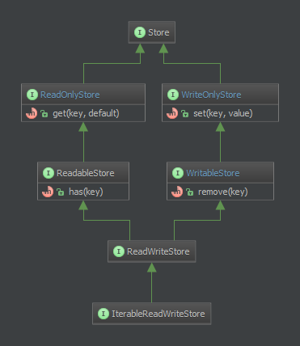

php-key-value-stores
====================

This project aims to provide a standard interface to common key-value-stores like memcache, redis or similar. If an author of a specific driver develops against these interfaces, is can be used everywhere the interfaces are implemented. This project does not ship a concrete implementations to existing stores.


Common interfaces
-----------------

### Stores

The simple version of the key value stores provide methods to set, get and remove a entry. There is also a method to test if a entry is existing:

```
interface ReadWriteStore
	public function has($key);
	public function get($key, $default=null);
	public function set($key, $value);
	public function remove($key);
```

The `ReadWriteStore`-Interface has no own methods. It extends the 2 Interfaces `ReadableStore` and `WritableStore` which in turn extend from other, more basic interfaces. The idea behind this is described [here](http://en.wikipedia.org/wiki/Interface_segregation_principle).




#### Behavior of stores

`has()` returns true when a key exists in the store and false if not. In addition to that, it throws an exception when `$key` is not a valid type (see valid types).

`get()` returns the content of a entry, referenced by `$key`. If the entry was not found, `get()` then returns `$default`. `$default` must be a value `value-type`. In addition to that, an `InvalidArgumentException` or deriving gets thrown when `$key` is not a valid key-type (see valid types) and an `InvalidOperationException` or deriving gets thrown for store specific reasons.

`set()` sets the value of an entry. If the corresponding entry does not exist, set will create it. If the entry already exists, set will overwrite its content. `set()` returns `$this` for a fluent interface. In addition to that, an `InvalidArgumentException` or deriving gets thrown when `$key` is not a valid key-type (see valid types) and an `InvalidOperationException` or deriving gets thrown for store specific reasons.

`remove()` removes an entry from a store. It throws an `InvalidOperationException` or deriving if this operation fails, caused by a missing entry or another process failure. In addition to that, an `InvalidArgumentException` or deriving gets thrown when `$key` is not a valid key-type (see valid types).


### Contexts

A context is similar to a table in a RDBMS. With contexts, you can separate stores for different environments or components. So a context is like a central singleton-repository for stores.

For example, a context could be used to define a database connection. Every store created by that context inherit that connection and possibly some metadata too.


### Valid types

#### Valid key-type

A key is valid if it is a string, int or object with a __toString() method. The store must not serialize and/or hash a key to convert any object to a string.


#### Valid value-type

A value (or default-value) is valid under the same criterias as a key-type. A default-value is also allowed to be `null`.


### Standard-tests

A store-author can make use of the provided standardtests to ensure compilance. So far, there are only tests for the `ReadWriteStore` and the `Contexts`. The tests are based in `phpunit 3.7`.


Installation via composer
-------------------------

composer require "rkr/php-key-value-stores" "v0.0.2"

